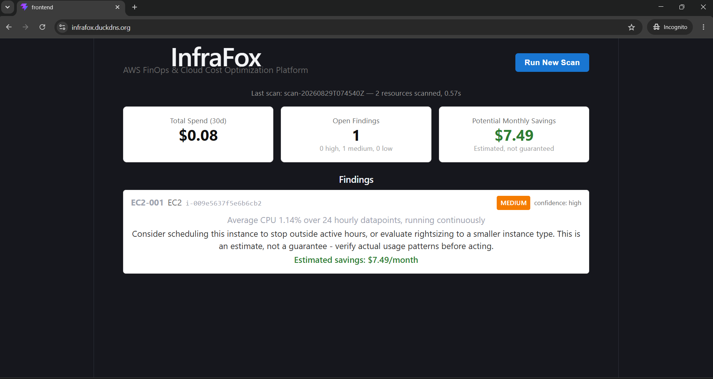
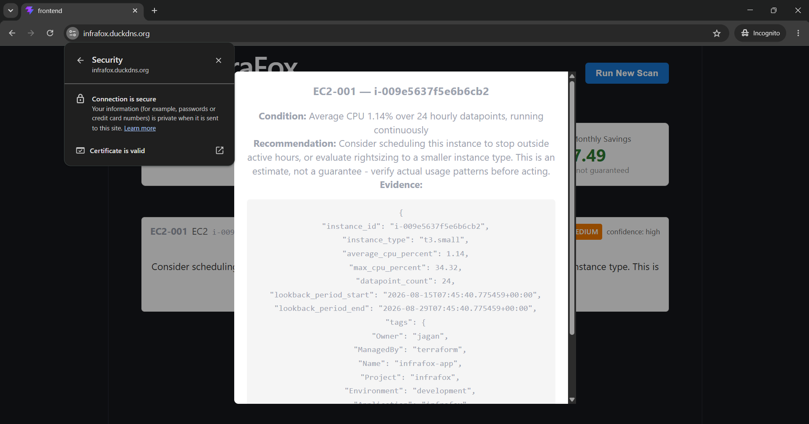
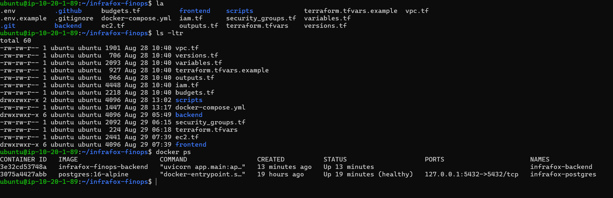
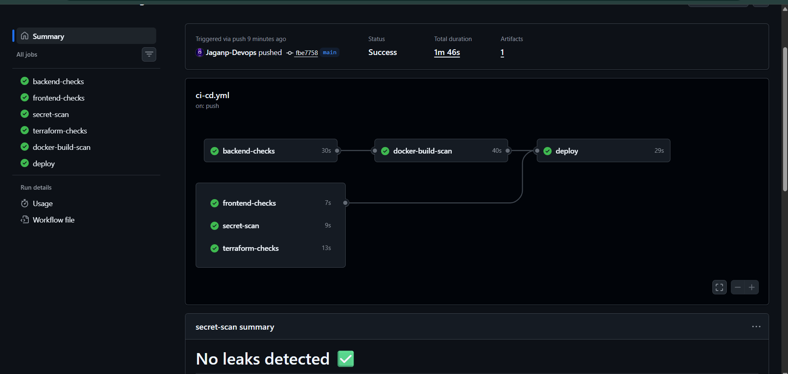
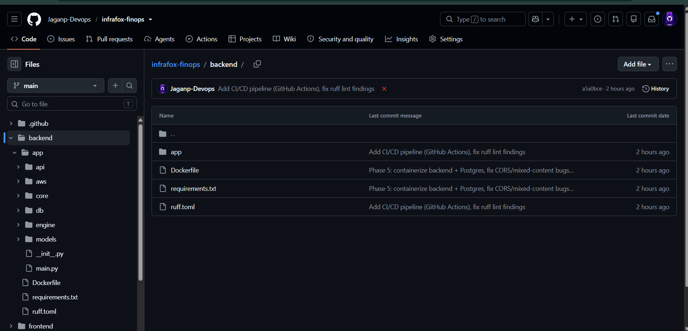

# InfraFox

**AWS FinOps & Cloud Cost Optimization Platform**

Live at: [infrafox.duckdns.org](https://infrafox.duckdns.org)

InfraFox scans a live AWS account, correlates cost data with real resource inventory and CloudWatch utilization, runs the result through a deterministic rule engine, and produces evidence-backed findings — waste, orphaned resources, missing ownership tags, underutilized compute — with estimated savings. It does not guess. Every finding carries the evidence that justifies it, and nothing is automatically remediated: this is a read-only, human-in-the-loop platform by design.



---

## The problem

Cloud accounts accumulate resources faster than teams retire them. A dev instance from three sprints ago keeps running. An EBS volume outlives the instance it was attached to. Nobody remembers who owns what, or whether a cost spike is expected or a mistake. Most teams find out from the invoice, not from monitoring.

InfraFox answers, for a given AWS account, right now:

- What is costing money, and why?
- Which specific resource is responsible?
- Is it actually being used?
- Is there a safe, evidence-backed recommendation?
- What's the estimated saving — stated honestly, not guaranteed?

## What it actually does (not a mockup)

This is a real platform running against a real AWS account (ap-south-1), not a demo with fixture data. Every finding is backed by real evidence pulled live from AWS — clicking into a finding shows the actual CloudWatch data, tags, and timestamps behind the recommendation:



During development, its rule engine caught a genuinely untagged, orphaned EBS volume and an idle EC2 instance on the developer's own account — real findings on real infrastructure, not staged examples.

## Architecture

```
Internet
   │
infrafox.duckdns.org (HTTPS via Let's Encrypt)
   │
Nginx (native, reverse proxy + TLS termination)
   ├── / ─────────► static React build (Vite)
   └── /api/ ─────► FastAPI backend (Docker container)
                          │
                          ├── boto3 → AWS Cost Explorer, EC2, CloudWatch, Tagging API
                          │   (via EC2 instance IAM role — no static credentials, anywhere)
                          │
                          └── PostgreSQL (Docker container, persistent volume)
```

Single EC2 instance (`t3.small`, ap-south-1), single AZ, no load balancer, no NAT gateway, no managed database.

Backend and database run as Docker containers on the host; Nginx and Certbot run natively for simpler, more reliable TLS certificate management:



## Stack

| Layer | Technology |
|---|---|
| Infrastructure | Terraform (VPC, EC2, IAM, Security Groups, Budgets) |
| Backend | Python, FastAPI, boto3, SQLAlchemy |
| Rule engine | Deterministic, evidence-based, no LLM in the critical path |
| Database | PostgreSQL (containerized) |
| Frontend | React 19, Vite |
| Reverse proxy / TLS | Nginx, Let's Encrypt (Certbot) |
| Containerization | Docker, Docker Compose |
| CI/CD | GitHub Actions (lint, test, security scan, build, deploy) |
| DNS | DuckDNS, auto-updated via cron |

## FinOps rule engine

Rules are structured, not hard-coded advice strings. Each one defines a condition, the evidence it requires, a severity, a confidence level (downgraded honestly when data is incomplete — e.g. a brand-new instance with only a few CloudWatch datapoints), and a savings estimate calculation.

| Rule ID | Checks |
|---|---|
| `EC2-001` | Sustained low CPU utilization on a continuously-running instance |
| `EBS-001` | Unattached EBS volume (pure waste) |
| `EBS-002` | Volume attached to a stopped instance (still billing) |
| `TAG-001` | Missing `Owner`/`Environment` tags (governance) |
| `EIP-001` | Unattached Elastic IP (billed from minute one) |

Full rule documentation: [`docs/finops-rules.md`](docs/finops-rules.md)

## CI/CD

Every push runs a full pipeline: backend lint + unit tests, frontend lint + build, secret scanning (Gitleaks), Terraform format/validate, Docker image build + vulnerability scan (Trivy), then an automated SSH deployment to the live instance with a post-deploy health check.



Deployment only runs after every other check passes — a failing lint, test, or security scan blocks production deployment automatically. See [`docs/incidents.md`](docs/incidents.md) for a real example of this working as intended during development.

## Security model

- **No static AWS credentials anywhere** — the EC2 instance uses an IAM role; boto3 picks up temporary credentials automatically via IMDSv2
- **Custom least-privilege IAM policy**, not the AWS-managed `ReadOnlyAccess` — scoped to exactly the Describe/Get/List actions the platform needs
- **Read-only by design** — no `Terminate*`, `Delete*`, `Stop*`, or `Modify*` permissions exist anywhere in the deployed role
- **Secrets never committed** — DuckDNS token, database password, and deploy keys live in environment files or GitHub Secrets, never in source control
- **HTTPS enforced** — HTTP requests redirect to HTTPS; TLS via Let's Encrypt with auto-renewal
- **CI security scanning** — Gitleaks (secret scanning), Trivy (container image vulnerabilities), pip-audit (dependency vulnerabilities), `ruff` (static analysis)

## Cost

Full breakdown, teardown instructions, and monitoring setup in [`COST-SAFETY.md`](COST-SAFETY.md). Summary: a single `t3.small` instance, ~$15–20/month if run continuously, well inside a $200 development budget even without ever stopping it. AWS Budgets configured with alerts at 50/80/100% of a $100 monthly ceiling.

## Repository structure

Clean separation between AWS integration, domain logic, the rule engine, and persistence:



```
infrafox-finops/
├── backend/              # FastAPI app, rule engine, AWS integration
│   └── app/
│       ├── aws/          # boto3 integration layer (read-only)
│       ├── engine/       # FinOps rule engine
│       ├── models/       # Pydantic domain models
│       ├── db/           # SQLAlchemy models, persistence
│       └── core/         # config, logging
├── frontend/             # React dashboard (Vite)
├── *.tf                  # Terraform infrastructure
├── docker-compose.yml    # Backend + Postgres orchestration
├── .github/workflows/    # CI/CD pipeline
├── scripts/              # DuckDNS update, deploy scripts
├── docs/                 # Architecture, rules, incidents, screenshots
├── COST-SAFETY.md
└── README.md
```

## Running it yourself

This is a personal infrastructure project tied to a specific AWS account, domain, and set of secrets — it isn't designed as a one-click deploy for others. If you want to adapt it:

1. Fork the repo
2. Provision your own AWS infrastructure via the Terraform in the repo root (see `terraform.tfvars.example`)
3. Set up your own domain (DuckDNS or otherwise) and update the Nginx config and CORS origins accordingly
4. Configure `.env` (see `.env.example`) with your own database password
5. Set the four required GitHub Secrets for CI/CD: `EC2_HOST`, `EC2_USER`, `EC2_SSH_PRIVATE_KEY`, `POSTGRES_PASSWORD`

## Status

Actively developed. Core platform (infrastructure, backend, rule engine, persistence, dashboard, containerization, HTTPS, CI/CD) is complete and running in production against a real AWS account. See [`docs/roadmap.md`](docs/roadmap.md) for what's deliberately deferred (multi-account support, scheduled remediation with approval workflows, forecasting) and why.

## License

Personal portfolio project. Not licensed for reuse as a managed service.
